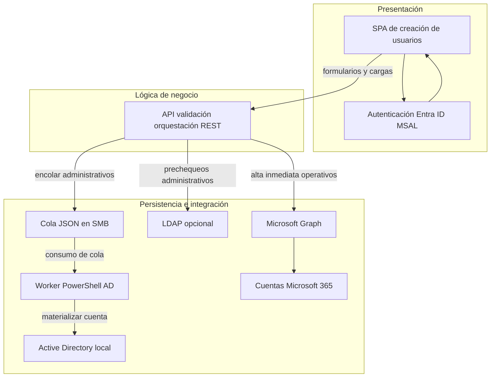
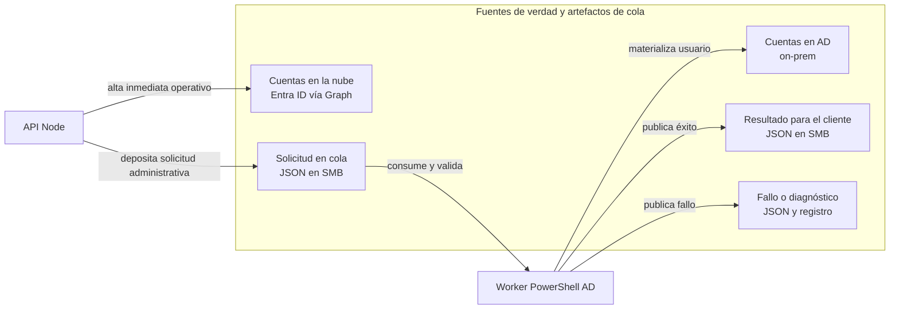
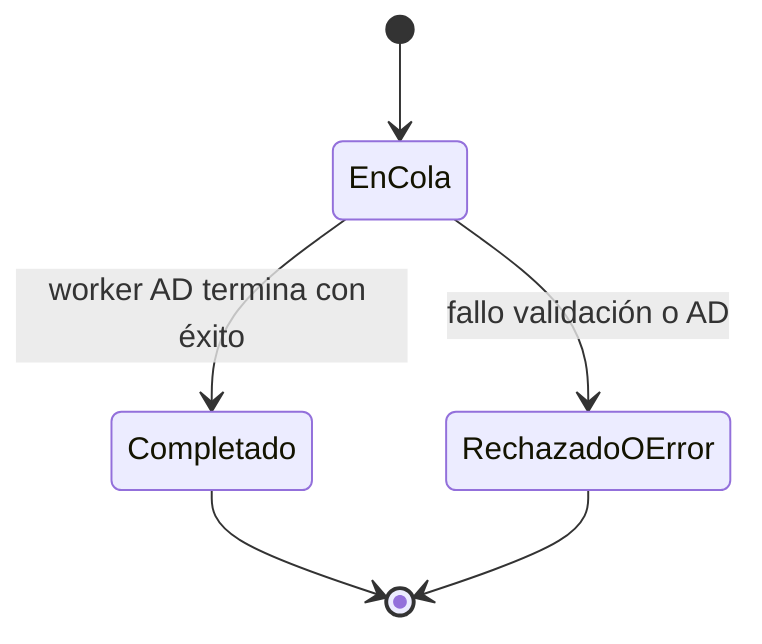

# Anexo 8. Manual Técnico

## Manual Técnico - Sistema de Creación de Usuarios (M365 + AD)

## Tabla de contenidos
1. Introducción
2. Arquitectura del sistema
   - 2.7 Tiempos estimados de procesamiento
3. Stack tecnológico
4. Estructura del proyecto
5. Módulos del sistema
6. Persistencia y flujo de datos
7. API REST
8. Integraciones externas
9. Seguridad
10. Testing y calidad
11. Despliegue y operación
12. Conclusión

---

## 1. Introducción

### 1.1 Descripción del sistema
Este sistema permite aprovisionar cuentas corporativas en dos escenarios:
- Usuarios operativos creados directamente en Microsoft 365 mediante Microsoft Graph.
- Usuarios administrativos creados en Active Directory local mediante un esquema de cola por archivos JSON en una ruta UNC (SMB), procesada por un script PowerShell en servidor.

La solución se compone de una SPA en React + TypeScript, un backend Node.js + Express y un proceso de servidor para materializar altas en AD.

### 1.2 Objetivos
- Automatizar el alta de usuarios con reglas consistentes de nomenclatura.
- Reducir errores operativos con validaciones previas y mensajes de error claros.
- Integrar de forma controlada Microsoft 365 y Active Directory on-premise.
- Permitir operación masiva (Excel) para ambos flujos.
- Mantener un diseño mantenible por capas (routes/controllers/services/utils).

### 1.3 Alcance
Incluye:
- Login y autorización en frontend con Microsoft Entra ID (MSAL + validación de grupo).
- API backend para altas operativas y administrativas.
- Carga masiva de altas desde Excel.
- Prevalidaciones de disponibilidad de nombre de usuario y cédula/employeeId.
- Encolado de solicitudes AD y consulta de resultados.

No incluye:
- Gestión de licenciamiento M365.
- Base de datos relacional propia para transacciones de negocio.
- Módulos biométricos o de reconocimiento facial.

### 1.4 Contexto operativo
En el flujo administrativo, el backend no ejecuta directamente `New-ADUser`: genera solicitudes en archivos y delega la creación al script de servidor `docs/server-scripts/Process-AdUserQueue.ps1`.

---

## 2. Arquitectura del sistema

### 2.1 Arquitectura conceptual

El sistema se describe en **tres capas** homogéneas: responsabilidad, tecnologías y comunicación. **No hay base de datos relacional propia** (ni PostgreSQL ni ORM de aplicación): la persistencia está repartida entre **directorios corporativos** (Entra ID / Graph, AD on-prem) y **archivos JSON en cola SMB** para el flujo administrativo asíncrono.

#### Capa de presentación

- **Responsabilidad:** interfaz de usuario (formularios operativo y administrativo, carga masiva Excel, seguimiento por polling del resultado de cola), experiencia de usuario, validación de formularios en el cliente, inicio de sesión y comprobación de pertenencia a grupo en Entra ID.
- **Tecnologías:** React, TypeScript, Vite, Axios, MSAL (`@azure/msal-browser`, `@azure/msal-react`). Estado y validación en cliente con **React** (hooks). En las dependencias actuales del frontend **no** figuran TanStack Query ni React Hook Form.
- **Comunicación:** HTTPS hacia la API REST del backend con cuerpos **JSON**; tokens de usuario mediante MSAL cuando aplica; en desarrollo puede usarse el proxy `/api` según `VITE_API_BASE_URL`.

#### Capa de lógica de negocio

- **Responsabilidad:** reglas de aprovisionamiento, validaciones de entrada, cálculo de nombres de usuario y variantes, orquestación de **Microsoft Graph** (altas operativas y prechequeos), prechequeos **LDAP** opcionales sobre AD, lectura y escritura de la **cola administrativa en UNC**, respuestas HTTP (incluido `202 Accepted` con `requestId` para administrativos), procesamiento de cargas masivas con parseo Excel.
- **Tecnologías:** Node.js, Express, `@azure/identity`, `@microsoft/microsoft-graph-client`, `ldapts`, `multer`, `xlsx`, `dotenv`, CORS; organización en rutas, controladores y servicios bajo `backend/src/`.
- **Comunicación:** recibe peticiones **HTTP/JSON** desde la SPA; invoca Graph con **client credentials**; consulta LDAP cuando está configurado; realiza operaciones de archivos sobre **SMB/UNC** para encolar y para leer resultados expuestos al cliente.

#### Capa de persistencia e identidades

- **Responsabilidad:** almacenar y exponer el estado real de usuarios y del flujo administrativo: cuentas en **Microsoft 365 / Entra ID** (operativos), cuentas en **AD on-prem** (administrativos tras el worker), artefactos en recurso compartido (`pendiente-*`, `resultado-*`, `procesados`, carpeta `error`) como medio de transacción asíncrona entre la API y el proceso en el servidor de dominio.
- **Tecnologías / sistemas:** API **Microsoft Graph**, **Active Directory** local, recurso **SMB/UNC**, script PowerShell `Process-AdUserQueue.ps1` (consumidor de cola y escritura en AD y en JSON de resultado); **Azure AD Connect** como vínculo de sincronización AD → nube (contexto de arquitectura, fuera del código de este repositorio).
- **Comunicación:** la API **persiste operativos** vía Graph; **persiste solicitudes administrativas** como archivos en SMB; el worker **lee la cola**, escribe en **AD** y en **JSON de resultado**; la API **lee** esos JSON para el endpoint de resultado; la SPA **consulta** ese endpoint hasta obtener estado final.

### 2.2 Diagrama lógico (alto nivel)

El siguiente diagrama resume el **recorrido de datos** alineado a las tres capas descritas en **§2.1**.

```mermaid
flowchart TD
  usuarioInterno[Usuario interno] --> spa["SPA corporativa\nReact + MSAL"]
  spa -->|"HTTPS y token de usuario"| api["API de aprovisionamiento\nNode.js + Express"]
  api -->|"client credentials"| graph["Cuentas en la nube\nEntra ID vía Graph"]
  api -->|"prechequeos de cédula o cuenta"| ldap["Consultas LDAP\nsobre Active Directory"]
  api -->|"deposita JSON de solicitud"| cola["Cola de solicitudes\nSMB / UNC"]
  cola -->|"lee y procesa archivos"| worker["Worker de altas AD\nPowerShell"]
  worker -->|"crea o actualiza cuenta"| adLocal["Active Directory\non-prem"]
  adLocal -->|"sincronización de directorio"| aadc["Azure AD Connect"]
  aadc --> m365["Microsoft 365"]
```

En el **flujo operativo** (M365), la API habla de forma **síncrona** con Graph: la respuesta HTTP cierra cuando el usuario ya existe en la nube (salvo errores). En el **flujo administrativo**, la API solo **valida y encola** en SMB; la **materialización** en AD ocurre después en el worker, y la interfaz obtiene el desenlace mediante **consultas repetidas** al resultado de cola (véase §5.5 y §6.4.2). Graph y LDAP actúan como **cortafuegos de negocio** antes de escribir en la cola o en el directorio.

### 2.3 Arquitectura lógica por componentes

El mismo modelo de **§2.1** (presentación, lógica de negocio, persistencia e integración) se representa aquí sin rutas de código. La correspondencia con carpetas y archivos del repositorio está en **§4 Estructura del proyecto**.



La **capa de presentación** concentra captura, permisos de grupo y llamadas HTTP. La **capa de lógica de negocio** (API Node/Express) decide si el tráfico va a Graph, a LDAP o a la cola. Dentro de **persistencia e integración**, el **worker** (típicamente `Process-AdUserQueue.ps1` en tarea programada, modo continuo recomendado) es el componente que ejecuta `New-ADUser` contra AD local. La operación detallada del Programador de tareas está en el manual de despliegue.

### 2.4 Arquitectura física (referencial)
- Cliente: navegador corporativo.
- Frontend: hosting de artefacto estático (`frontend/dist`).
- Backend: proceso Node.js en servidor o equipo corporativo con acceso a red interna.
- Cola AD: carpeta compartida UNC con permisos de escritura para el proceso Node.
- Servidor AD: ejecución de PowerShell con módulo ActiveDirectory y permisos de creación en OU.

### 2.5 Flujo end-to-end: alta operativa
1. Usuario autenticado completa formulario operativo.
2. Frontend envía `POST /api/users/operational`.
3. Backend valida datos y calcula candidato(s) de username.
4. Backend consulta Microsoft Graph para disponibilidad y crea cuenta final.
5. API responde datos del usuario creado.

### 2.6 Flujo end-to-end: alta administrativa
1. Usuario autenticado completa formulario administrativo.
2. Frontend puede consultar nombre sugerido (`GET /api/users/administrative/next-username`) y testear conectividad UNC.
3. Frontend envía `POST /api/users` o `POST /api/users/administrative`.
4. Backend valida campos, prechequea Graph/LDAP según configuración y genera JSON `pendiente-{uuid}.json` en UNC.
5. API responde `202 Accepted` con `requestId`.
6. Script PowerShell consume la solicitud, ejecuta validaciones AD y crea usuario con `New-ADUser`.
7. Script deja resultado (`resultado-*.json`) o mueve errores a `error/`.
8. Frontend consulta estado por `GET /api/users/administrative/queue-requests/:requestId/result`.

### 2.7 Tiempos estimados de procesamiento

#### Metodología de medición
- Fuente: mediciones internas sobre ejecuciones reales de los endpoints del sistema y seguimiento de solicitudes administrativas por `requestId`.
- Muestra de referencia:
  - Flujo operativo: 50 altas individuales (`POST /api/users/operational`).
  - Flujo administrativo: 40 altas individuales (`POST /api/users/administrative`) con tarea PowerShell en modo `-Continuous`.
- Ambiente de referencia: red corporativa estable, backend en ejecución local corporativa, conectividad activa a Microsoft Graph, carpeta UNC accesible y servidor AD con carga normal.
- Lectura de tiempos:
  - El tiempo de API administrativa (`202 Accepted`) mide solo validación y encolado en UNC.
  - El tiempo total administrativo incluye consumo por script AD y disponibilidad de resultado para polling.

#### Tabla de tiempos: flujo operativo (M365 directo)
| Etapa | Rango medido | Observaciones |
| --- | --- | --- |
| Captura y validación inicial en frontend | 60-140 ms | Incluye validación de campos antes del submit |
| Request frontend -> backend | 20-90 ms | Depende de latencia de red corporativa |
| Validaciones backend + candidatos de username | 15-60 ms | Normalización y cálculo de variantes de nombre |
| Consultas a Microsoft Graph (disponibilidad/creación) | 320-1100 ms | Es la etapa más variable del flujo operativo |
| Serialización y respuesta API | 10-40 ms | Tiempo de cierre de request |
| Total operativo extremo a extremo | 450-1400 ms | Sin reintentos y sin congestión extraordinaria |

#### Tabla de tiempos: flujo administrativo (cola AD + script)
| Etapa | Rango medido | Observaciones |
| --- | --- | --- |
| Captura y validación inicial en frontend | 70-150 ms | Validación de campos administrativos |
| Request frontend -> backend | 20-100 ms | Tramo de red interno |
| Validación backend (reglas + prechecks Graph/LDAP) | 120-650 ms | Incluye verificaciones previas de colisión |
| Escritura de `pendiente-{uuid}.json` y respuesta `202` | 25-180 ms | Cierre de tiempo API administrativo |
| Tiempo API administrativo (hasta `202 Accepted`) | 200-900 ms | No incluye procesamiento del servidor AD |
| Toma por script AD y ejecución `New-ADUser` | 1.5-8 s | Depende de `-Continuous`, carga y AD |
| Disponibilidad de `resultado-{uuid}.json` + polling | 0.5-3 s | Considera ciclo de consulta desde frontend |
| Total hasta confirmación en UI | 2.5-12 s | Incluye tramo API + ejecución AD + polling |

#### Variabilidad e interpretación operativa
- Factores de mayor impacto:
  - Latencia de Microsoft Graph y salud del tenant.
  - Estado de conectividad SMB/UNC y permisos efectivos de la cuenta del proceso Node.
  - Carga del servidor AD y frecuencia efectiva de ejecución del script (`-Continuous` vs tarea periódica).
  - Congestión de red corporativa y picos de procesamiento simultáneo.
- Recomendación de lectura para SLA interno:
  - Operativo: considerar objetivo de referencia <= 1.5 s por alta individual en condiciones normales.
  - Administrativo: separar SLA en dos tramos: `tiempo API` (sub-segundo típico) y `tiempo total con AD` (segundos, dependiente del consumidor de cola).
- Estos valores deben recalibrarse en cada cambio relevante de infraestructura, política de red, versión del script o patrón de carga.

---

## 3. Stack tecnológico

### 3.1 Backend
Node.js (`20`)
- Entorno de ejecución principal del backend.
- Permite una API ligera y rápida con un modelo asincrónico adecuado para integrar servicios externos (Graph/LDAP/SMB).

Express (`^4.18.2`)
- Framework web para construir la API REST del sistema.
- Organiza rutas, middleware y controladores de forma modular.
- Facilita manejo centralizado de errores y exposición de endpoints por dominio funcional.

CORS (`^2.8.5`)
- Middleware para control de origen cruzado entre frontend y backend.
- Se configura por variable de entorno para restringir dominios permitidos en cada ambiente.

dotenv (`^16.3.1`)
- Carga de variables de entorno para separar configuración sensible del código.
- Se usa para parámetros de Azure, cola AD, puertos y comportamiento por entorno.

Integración Microsoft Graph
- `@azure/identity` (`^4.0.1`): autenticación con credenciales de aplicación (client credentials).
- `@microsoft/microsoft-graph-client` (`^3.0.7`): cliente oficial para consultar y crear usuarios en Microsoft 365.

LDAP (`ldapts` `^8.1.7`)
- Biblioteca para prevalidaciones contra Active Directory.
- Permite verificar colisiones o disponibilidad de atributos antes de encolar solicitudes administrativas.

Carga masiva (`multer` `^1.4.5-lts.1`, `xlsx` `^0.18.5`)
- `multer` procesa archivos `multipart/form-data` enviados por el frontend.
- `xlsx` parsea plantillas Excel para creación masiva de usuarios operativos y administrativos.

### 3.2 Frontend
React (`^18.2.0`)
- Biblioteca base para la interfaz web.
- Implementa componentes funcionales y estado con hooks.
- Permite una SPA enfocada en formularios, validaciones y seguimiento de solicitudes.

TypeScript (`^5.2.2`)
- Tipado estático para reducir errores en tiempo de desarrollo.
- Mejora mantenibilidad y autocompletado en componentes, tipos de payload y cliente API.

Vite (`^5.0.8`)
- Herramienta de desarrollo y build del frontend.
- Ofrece recarga rápida en desarrollo (HMR) y empaquetado optimizado para producción.

Axios (`^1.6.0`)
- Cliente HTTP para consumir endpoints del backend.
- Centraliza manejo de base URL, errores y normalización de respuestas para la UI.

MSAL Browser (`^5.6.1`) + MSAL React (`^5.1.0`)
- Implementan autenticación con Microsoft Entra ID en la SPA.
- Gestionan sesión, adquisición de tokens y flujo de login/logout con integración nativa a React.

### 3.3 Testing y calidad
- Vitest (frontend y backend).
- Supertest para integración HTTP en backend.
- ESLint en frontend.
- Cobertura con `@vitest/coverage-v8`.

### 3.4 CI
Pipeline GitHub Actions en `.github/workflows/ci.yml`:
- Frontend: `npm ci`, `npm run lint`, `npm test`, `npm run build`.
- Backend: `npm ci`, `npm test`.

---

## 4. Estructura del proyecto

### 4.1 Raíz del repositorio
```text
proyecto/
├── frontend/
├── backend/
├── docs/
└── .github/workflows/
```

### 4.2 Backend (resumen)
```text
backend/
├── src/
│   ├── config/
│   ├── controllers/
│   ├── routes/
│   ├── services/
│   ├── utils/
│   ├── createApp.js
│   └── server.js
├── test/
├── scripts/
└── package.json
```

### 4.3 Frontend (resumen)
```text
frontend/
├── src/
│   ├── auth/
│   ├── components/
│   ├── services/
│   ├── types/
│   ├── utils/
│   ├── App.tsx
│   └── main.tsx
├── public/
└── package.json
```

### 4.4 Patrones aplicados
- Separación por capas: routes -> controllers -> services -> utils/config.
- Adaptador de servicios externos (Graph, LDAP, cola UNC).
- Validación temprana antes de side effects.
- Procesamiento asíncrono para AD vía cola de archivos.

---

## 5. Módulos del sistema

### 5.1 Autenticación y Autorización
Sistema de autenticación
- Basado en Microsoft Entra ID (MSAL) para autenticación de usuario en frontend.
- Control de acceso mediante verificación de pertenencia a grupo corporativo.
- Componentes principales: `frontend/src/auth/msalConfig.ts`, `frontend/src/auth/graph.ts`, `frontend/src/App.tsx`.

Flujo de autenticación y autorización
1. Usuario inicia sesión mediante flujo MSAL (`loginRedirect`).
2. Frontend obtiene contexto de cuenta autenticada.
3. Aplicación valida membresía de grupo con Graph (`checkMemberGroups`).
4. Si el usuario está autorizado, se habilita acceso al formulario.
5. Si no está autorizado, se bloquea la operación y se solicita cierre de sesión.

Reglas clave
- Solo personal del grupo autorizado puede operar la aplicación.
- El backend no implementa JWT propio; la autenticación de usuario se resuelve en el cliente con Entra ID.

### 5.2 Gestión de usuarios operativos (M365)
Sistema
- Alta directa de usuarios operativos en Microsoft 365 con integración Microsoft Graph.
- Generación automática de nombre de usuario y UPN con resolución de colisiones.

Endpoints principales
- `GET /api/users/next-username`
- `POST /api/users/operational`

Flujo operativo
1. Usuario captura datos requeridos en frontend.
2. Backend valida y genera candidatos de username/UPN.
3. Backend consulta disponibilidad y crea el usuario en Graph.
4. API devuelve confirmación de creación y datos principales de cuenta.

Reglas clave
- El correo corporativo debe ser único.
- Se aplican variantes de nombre para resolver colisiones.
- El proceso es sincrónico desde API (respuesta de creación en el mismo request).

### 5.3 Gestión de usuarios administrativos (AD)
Sistema
- Alta administrativa desacoplada por cola JSON en UNC y procesamiento en servidor AD.
- API encola solicitudes y retorna `requestId` para seguimiento.

Endpoints principales
- `POST /api/users`
- `POST /api/users/administrative`
- `GET /api/users/administrative/next-username`
- `GET /api/users/administrative/queue-connection-test`
- `GET /api/users/administrative/queue-requests/:requestId/result`

Flujo administrativo
1. Frontend envía solicitud administrativa al backend.
2. Backend valida datos, ejecuta prechecks Graph/LDAP y escribe `pendiente-{uuid}.json` en UNC.
3. API responde `202 Accepted` con `requestId`.
4. Script `Process-AdUserQueue.ps1` procesa la cola y ejecuta `New-ADUser`.
5. Frontend consulta el resultado por `requestId` hasta confirmar estado final.

Reglas clave
- `employeeId` es obligatorio y debe cumplir validaciones.
- El tiempo de API y el tiempo total de creación en AD son métricas distintas.
- La tarea del script en modo `-Continuous` impacta directamente la latencia final.

### 5.4 Carga masiva (Excel)
Sistema
- Procesamiento de plantillas Excel para altas múltiples en ambos dominios.

Endpoints principales
- `POST /api/users/operational/bulk`
- `POST /api/users/administrative/bulk`

Flujo resumido
1. Usuario carga archivo Excel (`multipart/form-data`, campo `file`).
2. Backend parsea filas y aplica validaciones por registro.
3. Para operativos: crea usuarios en Graph.
4. Para administrativos: encola solicitudes por cada fila válida.
5. API retorna resultados por fila (éxito/error).

Reglas clave
- Se toleran variaciones de encabezados dentro de los patrones soportados.
- Una fila inválida no bloquea necesariamente el procesamiento del resto.

### 5.5 Seguimiento y resultados de cola
Sistema
- Consulta del estado de solicitudes administrativas encoladas.
- Diagnóstico de conectividad de escritura en UNC.

Endpoints principales
- `GET /api/users/administrative/queue-requests/:requestId/result`
- `GET /api/users/administrative/queue-connection-test`

Flujo resumido
1. Frontend recibe `requestId` al encolar.
2. Frontend realiza polling del endpoint de resultado.
3. Cuando existe `resultado-{uuid}.json`, se muestra estado final al usuario.

Reglas clave
- Errores de permisos UNC o de ejecución del script se reflejan en resultado/log.
- El seguimiento por `requestId` garantiza trazabilidad de cada solicitud.

---

## 6. Persistencia y flujo de datos

### 6.1 Modelo de persistencia real
El sistema no utiliza una base de datos de aplicación (no hay ORM ni migraciones locales). El estado se gestiona mediante:
- Directorios y archivos JSON de cola AD en ruta UNC.
- Directorios de resultado/procesados/error en el flujo de servidor.
- Información viva consultada en Microsoft Graph y LDAP.

### 6.2 Esquema principal de almacenamiento
#### Operarios (Microsoft 365 / Entra ID)
La información de usuarios operativos se almacena en el directorio cloud de Microsoft 365, accedido vía Graph.

Campos principales (referenciales):
- `id`
- `displayName`
- `givenName`
- `surname`
- `userPrincipalName`
- `mailNickname`
- `jobTitle`
- `department`
- `accountEnabled`

#### Administrativos (Active Directory on-premise)
La información de usuarios administrativos se almacena en Active Directory local, creada por el script PowerShell.

Campos principales (referenciales):
- `SamAccountName`
- `UserPrincipalName`
- `Name` / `DisplayName`
- `GivenName`
- `Surname`
- `EmployeeID`
- `Department`
- `Title`
- `Enabled`
- `DistinguishedName` (OU destino)

#### Intercambio asíncrono (cola JSON UNC)
El backend usa archivos JSON como mecanismo transaccional entre API y servidor AD.

Estructuras principales:
- `pendiente-{requestId}.json`: solicitud pendiente de creación.
- `resultado-{requestId}.json`: resultado de ejecución (éxito o error).
- `error/*.json` + `.log`: solicitudes fallidas y detalle técnico.

### 6.3 Consistencia y validaciones
- Validación previa en backend para minimizar rechazos tardíos.
- Revalidación en script AD para evitar colisiones en directorio local.
- Trazabilidad por `requestId` a lo largo del flujo.

### 6.4 Diagrama recomendado para documentar datos (sin BD relacional propia)
Para este proyecto, el diagrama de datos recomendado no es un ER de tablas SQL, porque no existe una base de datos relacional de aplicación. La documentación debe centrarse en persistencia distribuida y estados de cola.

#### 6.4.1 Persistencia distribuida (fuente de verdad por dominio)
En disco, la cola administrativa usa convenciones de nombre: `pendiente-{requestId}.json` para la solicitud, `resultado-{requestId}.json` para el cierre visible al cliente, carpeta `error/` y registros asociados para fallos. El diagrama resume **roles y flujo de datos**, no rutas UNC concretas.



#### 6.4.2 Estados de la solicitud administrativa por `requestId`
El siguiente diagrama describe el **ciclo de vida lógico** de una solicitud administrativa (sin nombres de archivo en las transiciones).



**Correspondencia en disco:** el paso a **Completado** suele coincidir con la aparición de `resultado-{requestId}.json`; **RechazadoOError** con archivos bajo `error/` y trazas `.log`.

**Polling en la SPA:** tras `202 Accepted` con `requestId`, el frontend **consulta de forma periódica** `GET /api/users/administrative/queue-requests/:requestId/result` hasta que el backend expone un resultado estable (éxito o error), sin bloquear el hilo principal de la interfaz hasta que el worker haya cerrado la solicitud.

#### 6.4.3 Nota para documentación académica
- Si se solicita un "diagrama de BD", usar este esquema como diagrama de persistencia real del sistema.
- Un diagrama ER clásico solo debe presentarse como modelo conceptual no implementado, nunca como esquema físico actual.

#### 6.4.4 ERD conceptual no relacional (referencia PlantUML)
- Archivo de referencia: `docs/diagramas/erd-conceptual-persistencia.puml`.
- Este ERD es conceptual y documenta correlaciones por identificadores (`requestId`, `employeeId`) entre documentos JSON de cola AD y entidades de directorio.
- No representa tablas SQL ni claves foraneas fisicas, porque el sistema no implementa base de datos relacional de aplicacion.

---

## 7. API REST

### 7.1 Convenciones generales
- Base URL: `/api/users` para dominios de aprovisionamiento.
- Formato: JSON (excepto cargas `multipart/form-data`).
- Health check: `GET /health`.
- Respuestas de error en formato JSON con código HTTP apropiado.

### 7.2 Endpoints principales

Operativos:
- `GET /api/users/next-username`
- `POST /api/users/operational`
- `POST /api/users/operational/bulk`

Administrativos:
- `POST /api/users`
- `POST /api/users/administrative`
- `POST /api/users/administrative/bulk`
- `GET /api/users/administrative/next-username`
- `GET /api/users/administrative/queue-connection-test`
- `GET /api/users/administrative/queue-requests/:requestId/result`

Infra:
- `GET /health`

### 7.3 Códigos de estado esperados
- `200 OK`: consultas exitosas.
- `201 Created`: operación de creación sin cola (operativos).
- `202 Accepted`: solicitud encolada para AD.
- `400 Bad Request`: validación de entrada.
- `409 Conflict`: colisiones (por ejemplo employeeId duplicado).
- `422 Unprocessable Entity`: reglas de negocio no cumplidas.
- `500 Internal Server Error`: error no controlado.
- `503 Service Unavailable`: configuración o dependencia no disponible.

### 7.4 Manejo de errores
El backend centraliza errores con middleware global. Para payload excesivo retorna `413` y para el resto consolida mensaje JSON con detalle de error.

---

## 8. Integraciones externas

### 8.1 Microsoft Graph
Uso principal:
- Creación de usuarios operativos.
- Prechequeos de disponibilidad y duplicados.

Autenticación:
- Client credentials mediante variables `AZURE_TENANT_ID`, `AZURE_CLIENT_ID`, `AZURE_CLIENT_SECRET`.

Archivo clave:
- `backend/src/config/graphClient.js`

### 8.2 Microsoft Entra ID (frontend)
Uso:
- Inicio de sesión y obtención de token con MSAL.
- Validación de grupo autorizado en frontend.

Archivos clave:
- `frontend/src/auth/msalConfig.ts`
- `frontend/src/auth/msalInstance.ts`
- `frontend/src/auth/graph.ts`

### 8.3 LDAP (AD)
Uso:
- Prevalidaciones de datos de usuario en flujo administrativo.

Archivos clave:
- `backend/src/services/adLdapEmployeeIdPrecheck.js`
- `backend/src/services/adLdapSamAccountPick.js`

### 8.4 Cola AD por UNC + PowerShell
Uso:
- Patrón de desacople entre API web y operación AD local.
- Consumidor de cola en script PowerShell.

Archivos clave:
- `backend/src/config/adQueueConfig.js`
- `backend/src/services/adQueueUserService.js`
- `docs/server-scripts/Process-AdUserQueue.ps1`
- `docs/server-scripts/README.md`

---

## 9. Seguridad

### 9.1 Identidad y acceso
- Frontend protegido por autenticación MSAL y check de grupo corporativo.
- Backend enfocado en seguridad por red/entorno corporativo y validaciones de negocio.

### 9.2 Protección de configuración sensible
- Secretos fuera de código fuente, gestionados por variables de entorno.
- Archivos `.env` no versionados.

### 9.3 CORS y control de payload
- CORS configurable por `CORS_ORIGIN`.
- Límite de JSON de entrada configurado en `128kb`.

### 9.4 Validación de entrada
- Validaciones de formato y obligatoriedad en frontend y backend.
- Reglas especiales para `employeeId`, datos de nombre y cargas masivas.

### 9.5 Riesgos y recomendaciones
- Asegurar ACL mínimas en carpeta UNC.
- Ejecutar una sola instancia del consumidor de cola AD por ruta.
- Rotar secretos de Azure periódicamente.
- Incorporar autenticación explícita en backend si se expone fuera de red interna.

---

## 10. Testing y calidad

### 10.1 Estrategia
- Pruebas unitarias para utilidades y reglas de negocio.
- Pruebas de integración HTTP en backend con Supertest.
- Pruebas de cliente API y utilidades en frontend.

### 10.2 Backend
- Runner: Vitest.
- Cobertura: V8.
- Suites en `backend/test/`.

### 10.3 Frontend
- Runner: Vitest.
- Linting: ESLint.
- Suites enfocadas en `src/services` y `src/utils`.

### 10.4 Ejecución local
Backend:
- `npm test`
- `npm run test:coverage`

Frontend:
- `npm test`
- `npm run lint`
- `npm run test:coverage`

---

## 11. Despliegue y operación

### 11.1 Entornos y prerequisitos
- Node.js versión alineada a `.nvmrc`.
- Variables de entorno de backend y frontend desde sus `.env.example`.
- Conectividad de red corporativa a Graph y recursos internos (UNC/AD).

### 11.2 Backend
- Desarrollo: `npm run dev`.
- Producción: `npm start`.
- Debe ejecutar con identidad de Windows que tenga acceso de escritura a `AD_QUEUE_UNC` cuando aplique flujo administrativo.

### 11.3 Frontend
- Desarrollo: `npm run dev`.
- Build: `npm run build`.
- Publicación como sitio estático (`frontend/dist`).

### 11.4 Operación de cola AD
- Tarea programada ejecutando `Process-AdUserQueue.ps1`.
- Modo recomendado: `-Continuous`.
- Verificaciones operativas:
  - Permisos AD para cuenta de tarea.
  - Módulo ActiveDirectory disponible.
  - Monitoreo de carpeta `error/` y logs.

### 11.5 CI
El flujo de CI valida calidad mínima en cada push/pull request a ramas principales:
- Frontend: instalación, lint, test y build.
- Backend: instalación y test.

---

## 12. Conclusión
La solución implementa un aprovisionamiento híbrido pragmático entre Microsoft 365 y Active Directory on-premise, con separación clara de responsabilidades entre UI, API y ejecución AD. Su diseño prioriza trazabilidad (`requestId`), validación previa y operación segura en entorno corporativo, manteniendo una base de código modular y verificable por pruebas automáticas y CI.

